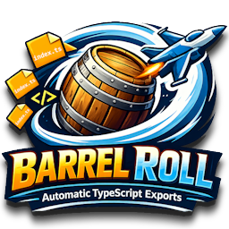

<p align="center">
  
</p>

# Barrel Roll

[](https://github.com/Coderrob/barrel-roll/actions/workflows/ci.yml)
[](https://prettier.io/)
[](badges/coverage.svg)
[](https://eslint.org/)
[](LICENSE)
[](package.json)
[](https://www.typescriptlang.org/)
[](https://marketplace.visualstudio.com/items?itemName=Coderrob.barrel-roll)
[](https://marketplace.visualstudio.com/items?itemName=Coderrob.barrel-roll)

Barrel Roll is a Visual Studio Code extension that automates creation and maintenance of `index.ts` barrel files. Right-click a folder, run a Barrel Roll command, and the extension generates exports from real TypeScript declarations while keeping output deterministic and readable.

## Features

- Right-click generation of `index.ts` barrel files from the VS Code explorer
- Two command modes: single directory and recursive directory processing
- Recursive barrel generation for child folders with parent re-export wiring
- Export detection for TypeScript values, type-only exports, and default exports
- Stable alphabetical ordering to keep diffs small and predictable
- Sanitized updates that preserve direct definitions in existing `index.ts`
- Built-in safeguards for ignored directories and oversized files

## Installation

### From VS Code Marketplace

1. Open VS Code
1. Go to Extensions (`Ctrl+Shift+X` / `Cmd+Shift+X`)
1. Search for `Barrel Roll`
1. Click Install

### From VSIX

1. Download the latest `.vsix` file from the [releases page](https://github.com/Coderrob/barrel-roll/releases)
1. In VS Code, go to Extensions
1. Click the `...` menu and select `Install from VSIX...`
1. Select the downloaded file

## Usage

1. Right-click a folder in the VS Code explorer
1. Run one of these commands:
   - `Barrel Roll Directory`
   - `Barrel Roll Directory (Recursive)`
1. Barrel Roll will:
   - scan `.ts`/`.tsx` files (excluding `index.ts`, declaration files, and test files)
   - generate or update `index.ts`
   - recursively generate child barrels when recursive mode is selected
   - preserve direct definitions in existing index files while refreshing export lines

You can also run both commands from the Command Palette.

### Example

Given:

```typescript
// user.ts
export class User {}
export interface UserData {}

// auth.ts
export function login() {}
export function logout() {}

// constants.ts
export const API_URL = 'https://api.example.com';
```

Barrel Roll generates:

```typescript
// index.ts
export { login, logout } from './auth.js';
export { API_URL } from './constants.js';
export { User } from './user.js';
export type { UserData } from './user.js';
```

## Development

### Prerequisites

- Node.js 18+
- npm 8+

### Common commands

```bash
npm install
npm run compile
npm run compile-tests
npm run test
npm run test:unit
npm run test:vscode
npm run lint
npm run deps:check
npm run quality
```

### Testing notes

- `npm test` runs compile, lint, dependency check, then the Node test suite via `scripts/run-tests.cjs`.
- `npm run test:unit` runs a faster compile + test path without lint.
- Unit and integration tests live under `src/test/`.
- Unit test names must start with `should`.

### Dependency checking

`npm run deps:check` uses `scripts/run-depcheck.cjs` (programmatic depcheck runner). It writes `.depcheck.json`, filters known script/repository references, and fails when unused dependencies remain.

### Packaging and release

```bash
# Build production bundle used by VS Code prepublish
npm run package

# Build VSIX package
npm run ext:package

# Install latest packaged VSIX locally
npm run ext:install

# Build + install
npm run ext:reinstall
```

### VSIX contents

Publishing uses an allowlist in `.vscodeignore` so only runtime assets are intentionally included:

- `package.json`
- `LICENSE`
- `README.md`
- `dist/extension.js`
- `public/img/barrel-roll-icon.png`

Use `npx @vscode/vsce ls` to inspect final package contents before publishing.

## Known limitations

- Scans only `.ts` and `.tsx` source files.
- Dynamic runtime-created named exports cannot be statically detected.
- Existing `index.ts` content is sanitized to preserve direct declarations, but malformed export syntax may still require manual cleanup.

## Architecture

For architecture details and module-level responsibilities, see `ARCHITECTURE.md`.

## Contributing

Contributions are welcome. See `CONTRIBUTING.md` and `AGENTS.md` for contribution and automation details.

## License

Apache 2.0. See [LICENSE](LICENSE).

## Ownership

Maintained by Rob "Coderrob" Lindley.
