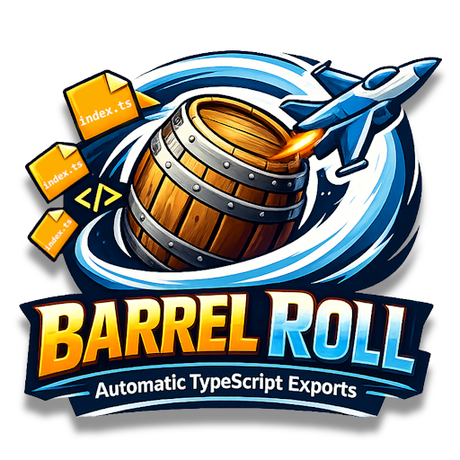

<p align="center">
  
</p>

# Barrel Roll

[](https://github.com/Coderrob/barrel-roll/actions/workflows/ci.yml)
[](https://prettier.io/)
[](badges/coverage.svg)
[](https://eslint.org/)
[](LICENSE)
[](package.json)
[](https://www.typescriptlang.org/)
[](https://marketplace.visualstudio.com/items?itemName=Coderrob.barrel-roll)
[](https://marketplace.visualstudio.com/items?itemName=Coderrob.barrel-roll)

Barrel Roll is a Visual Studio Code extension that makes barrel file creation and upkeep effortless. Right-click any folder, pick a Barrel Roll command, and the extension assembles a curated `index.ts` that reflects the exports your module actually exposes—no tedious manual wiring, no temptation to `export *` the entire directory.

Whether you need a single barrel refreshed or an entire tree brought into alignment, Barrel Roll keeps your exports clean, consistent, and ready for real work. It discovers TypeScript exports, connects child barrels to their parents, and prevents duplicate re-exports so your team can focus on building features instead of shuffling files.

## Features

- **Right-click Generation**: Right-click any folder in the VS Code explorer to generate or update an `index.ts` barrel file
- **Two Command Modes**: Choose between updating just the selected directory or traversing the full subtree via dedicated context menu entries
- **Recursive Barrels**: Automatically walks child folders, generating barrels for every directory and wiring parent barrels to re-export their children
- **Smart Export Detection**: Automatically detects and exports all TypeScript exports (classes, interfaces, types, functions, constants, enums)
- **Clean Architecture**: Follows SOLID principles for maintainability and extensibility
- **Parent Folder Filtering**: Automatically removes re-exports from parent folders
- **Alphabetical Ordering**: Generates consistently ordered exports for better readability

## Installation

### From VS Code Marketplace

1. Open VS Code
1. Go to Extensions (Ctrl+Shift+X / Cmd+Shift+X)
1. Search for "Barrel Roll"
1. Click Install

### From VSIX

1. Download the latest `.vsix` file from the [releases page](https://github.com/Coderrob/barrel-roll/releases)
1. In VS Code, go to Extensions
1. Click the `...` menu and select "Install from VSIX..."
1. Select the downloaded file

## Usage

1. Right-click on any folder in the VS Code explorer
1. Select one of the Barrel Roll commands:
   - `Barrel Roll: Barrel Directory` (updates only the selected folder)
   - `Barrel Roll: Barrel Directory (Recursive)` (updates the selected folder and all subfolders)
1. The extension will:
   - Scan all `.ts`/`.tsx` files in the folder (excluding `index.ts` and declaration files)
   - Recursively process each subfolder and generate its `index.ts`
   - Extract all exported items
   - Generate or update an `index.ts` file with proper exports and re-export child barrels
   - Filter out any re-exports from parent directories

You can also invoke these commands from the Command Palette (`Ctrl+Shift+P` / `Cmd+Shift+P`) by searching for their names.

### Example

Given these files in a folder:

```typescript
// user.ts
export class User {}
export interface UserData {}

// auth.ts
export function login() {}
export function logout() {}

// constants.ts
export const API_URL = 'https://api.example.com';
```

Running Barrel Roll will generate:

```typescript
// index.ts
export { API_URL } from './constants';
export { login, logout } from './auth';
export { User, UserData } from './user';
```

## Development

### Prerequisites

- Node.js 18.x or later
- npm 8.x or later

### Setup

```bash
npm install
```

### Compile

```bash
npm run compile
```

### Compile Tests

```bash
npm run compile-tests
```

### Watch Mode

```bash
# Watch for changes and recompile
npm run watch

# Watch for test changes and recompile
npm run watch-tests
```

### Testing

```bash
# Run all tests (includes pretest: compile, lint, deps check)
npm test

# Run unit tests only (compiles tests and extension, then runs tests)
npm run test:unit

# Run VS Code integration tests (compiles tests, then runs VS Code test harness)
npm run test:vscode

# Run coverage analysis (includes pretest + c8 coverage + badge generation)
npm run coverage

# Check coverage thresholds
npm run coverage:check
```

> **Note:** `npm test` runs the full pretest pipeline (compile tests, compile extension, lint) before executing tests. `npm run test:unit` compiles and runs tests directly without linting.

### Linting

```bash
npm run lint
npm run lint:fix
```

> **Note:** `npm run lint` now runs a dependency check as part of the pipeline (`npm run deps:check`). This invokes the programmatic depcheck runner (`scripts/run-depcheck.cjs`) which writes `.depcheck.json` and will cause the command to fail if unused dependencies remain.

### Formatting

```bash
npm run format
npm run format:check
```

### Type Checking

```bash
npm run typecheck
```

### Quality Checks

```bash
# Run all quality checks (linting, duplication, circular dependencies)
npm run quality

# Check for code duplication
npm run duplication

# Check for circular dependencies
npm run madge

# Check dependencies (dependency check is also available as a standalone command)
npm run lint:deps
npm run deps:check
```

**Dependency check details:** The project uses a programmatic depcheck runner (`scripts/run-depcheck.cjs`) that writes `.depcheck.json` and filters references found in scripts and repository files. This ensures unused packages are detected reliably without relying on `npx`.

### Coverage

```bash
# Generate coverage report and badge
npm run coverage

# Generate coverage badge only
npm run coverage:badge

# Check coverage thresholds
npm run coverage:check
```

### Extension Packaging

```bash
# Package extension for distribution
npm run package

# Install packaged extension locally
npm run ext:install

# Package and install in one command
npm run ext:reinstall
```

## Architecture

The extension follows SOLID principles with clear separation of concerns:

- **BarrelFileGenerator**: Main orchestrator coordinating the barrel file generation process
- **FileSystemService**: Handles all file I/O operations
- **ExportParser**: Extracts export statements from TypeScript code
- **BarrelContentBuilder**: Builds the formatted content for barrel files

This architecture ensures:

- **Single Responsibility**: Each class has one clear purpose
- **Open/Closed**: Easy to extend without modifying existing code
- **Dependency Inversion**: High-level modules don't depend on low-level details
- **Testability**: Each component can be tested in isolation

## Contributing

Contributions are welcome! Please feel free to submit a Pull Request.

For developer notes on automation, dependency checks, test conventions, and other agent-related details see `AGENTS.md`.

## License

Apache-2.0
